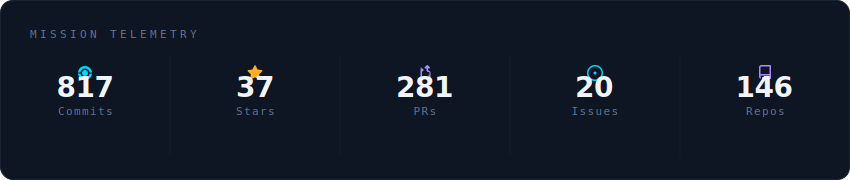

# Matheus Carmo

Como CTO e arquiteto de software, tenho dedicado minha carreira ao avanço da tecnologia e à inovação prática. Fora do escritório, sou mais conhecido por minha dedicação à família e meu amor pela música e pelo Brazilian Jiu-Jitsu, que me mantêm equilibrado e focado.

Meu compromisso com a educação e o empoderamento através da tecnologia se manifesta no meu envolvimento com iniciativas de ensino de programação para comunidades carentes. Acredito firmemente que a tecnologia é uma ferramenta poderosa para a mudança social e dedico meu tempo livre para garantir que ela esteja acessível a todos, independentemente de sua origem.

  

 

  

 

  

 

  

